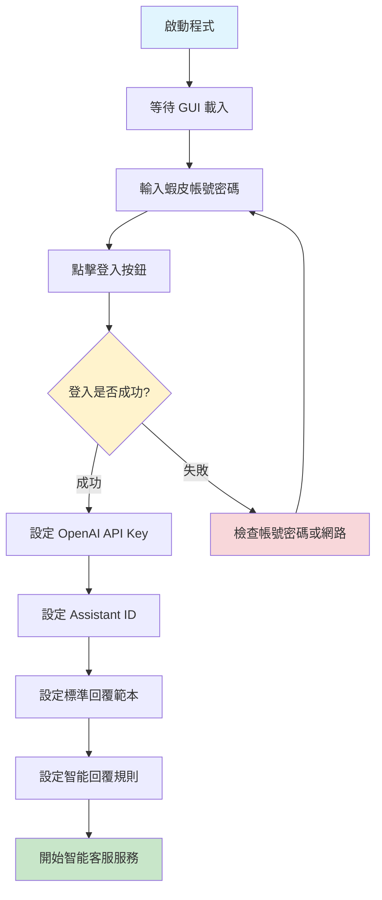

# 🤖 蝦皮聊聊智能客服系統

<div align="center">


**一個整合 OpenAI ChatGPT 的蝦皮賣家智能客服自動化系統**

[功能特色](#-主要功能) • [快速開始](#-快速開始) • [安裝指南](#-安裝指南) • [設定說明](#-設定說明)

</div>

---

## 📋 專案簡介

這是一個專為蝦皮賣家設計的智能客服系統，結合了現代化的 GUI 介面與強大的 AI 技術。系統能夠自動化處理蝦皮賣家中心的客服訊息，透過 OpenAI 的 ChatGPT 提供智能回覆，大幅提升客服效率與品質。

### 🎯 核心價值
- **自動化處理**：減少人工客服工作量，24/7 不間斷服務
- **智能回覆**：基於 ChatGPT 的上下文理解，提供準確且人性化的回覆
- **安全可靠**：內建硬體授權機制，保護您的帳號安全
- **易於使用**：直觀的 GUI 介面，無需技術背景即可操作

## ✨ 主要功能

<table>
<tr>
<td width="50%">

### 🔐 自動登入系統
- 自動化登入蝦皮賣家中心
- 智能處理驗證碼與等待邏輯
- 支援多種登入方式

### 🤖 智能客服核心
- 整合 OpenAI Threads/Assistants API
- 支援多輪對話上下文理解
- 可自定義回覆風格與內容

</td>
<td width="50%">

### 🖥️ 現代化 GUI 介面
- 基於 PyQt5 的直觀操作介面
- 支援工作日與時段規則設定
- 即時狀態監控與日誌顯示

### 📊 智能管理系統
- CSV 格式回覆名單管理
- 避免重複回覆機制
- 硬體授權安全驗證

</td>
</tr>
</table>

## 🎬 實際應用案例

<div align="center">

### 📹 系統操作演示

https://github.com/user-attachments/assets/實際應用案例(標準回覆).mp4

*觀看智能客服系統的實際操作流程與標準回覆範例*

</div>

## 🛠️ 系統需求

| 項目 | 需求 |
|------|------|
| **作業系統** | Windows 10/11 |
| **Python 版本** | 3.10 或 3.11（建議 3.11） |
| **瀏覽器** | Google Chrome（自動下載對應 ChromeDriver） |
| **API 需求** | 可用的 OpenAI API Key 與 Assistant ID |
| **記憶體** | 建議 4GB 以上 |
| **硬碟空間** | 至少 1GB 可用空間 |

## 📦 安裝指南

### 方法一：使用 Conda（推薦）

> 💡 **建議使用 conda 建立獨立環境，避免 Qt/插件混裝問題**

```bash
# 1. 建立新的 conda 環境
conda create -n shopee311 python=3.11 -y
conda activate shopee311

# 2. 安裝 GUI 與基礎套件（使用 conda）
conda install -y -c conda-forge \
  pyqt=5.15.10 \
  selenium=4.15.2 \
  apscheduler=3.10.4 \
  beautifulsoup4=4.12.2 \
  blinker=1.7.0 \
  requests=2.31.0 \
  urllib3=2.1.0

# 3. 使用 pip 安裝 conda 沒有的套件
python -m pip install -U pip setuptools wheel
pip install webdriver-manager==4.0.1 openai==1.3.7
```

### 方法二：使用 pip + venv

```bash
# 1. 建立虛擬環境
python -m venv shopee_env
shopee_env\Scripts\activate

# 2. 安裝依賴套件
pip install -r requirements.txt
```

> ⚠️ **重要提醒**：請勿同時在同一環境中安裝 conda 的 `pyqt` 與 pip 的 `PyQt5`，否則可能導致 Qt 插件衝突。

## 🚀 快速開始

### 執行方式

#### 方法一：標準模式啟動
```bash
# 啟動主程式
python main.py
```

#### 方法二：GUI 模式啟動
```bash
# 設定環境變數，將狀態輸出顯示在 GUI 視窗
set STD_TO_GUI=1
python main.py
```

### 🎯 首次使用步驟

<div align="center">



</div>

1. **啟動程式**：執行 `python main.py`
2. **輸入憑證**：在 GUI 介面中輸入蝦皮賣家帳號與密碼
3. **登入驗證**：點擊登入按鈕，等待系統驗證帳號
4. **AI 設定**：登入成功後，配置 OpenAI API Key 與 Assistant ID
5. **回覆設定**：設定標準回覆範本與智能回覆規則
6. **開始服務**：完成所有設定後，系統將自動開始智能客服服務

> 💡 **重要提醒**：必須先成功登入蝦皮賣家中心，才能進行後續的 AI 和回覆設定。

## ⚙️ 設定說明

### 資料庫配置

系統使用 SQLite 資料庫 `database.db` 儲存重要設定資訊：

#### 資料庫結構
```sql
CREATE TABLE IF NOT EXISTS data (
  id INTEGER PRIMARY KEY,
  expected_serial TEXT,           -- 硬體授權識別值（CPU 相關）
  chatgpt_api_key TEXT,          -- OpenAI API Key
  chatgpt_assistant_id TEXT      -- OpenAI Assistant ID
);
```

#### 初始化資料
```sql
INSERT OR REPLACE INTO data (id, expected_serial, chatgpt_api_key, chatgpt_assistant_id)
VALUES (1, 'YOUR_CPU_SERIAL_OR_SIGNATURE', 'YOUR_OPENAI_API_KEY', 'YOUR_ASSISTANT_ID');
```

### 🔑 API 設定

| 參數 | 說明 | 取得方式 |
|------|------|----------|
| **OpenAI API Key** | 用於 ChatGPT 服務的 API 金鑰 | [OpenAI Platform](https://platform.openai.com/api-keys) |
| **Assistant ID** | 自定義的 AI 助手 ID | [OpenAI Assistants](https://platform.openai.com/assistants) |
| **Hardware Serial** | 硬體授權識別碼 | 系統自動生成 |

### 🍪 Cookie 自動登入設定

系統支援使用 Cookie 進行自動登入，避免每次都需要手動輸入帳號密碼。

#### Cookie 檔案位置
```
%UserProfile%\Documents\蝦皮聊聊智能客服\cookies.json
```

#### 自動 Cookie 管理
- **自動匯出**：成功登入後，系統會自動將登入狀態儲存為 `cookies.json`
- **自動匯入**：程式啟動時會自動檢查並載入已儲存的 Cookie
- **智能跳過**：如果 Cookie 無效或過期，系統會自動切換到手動登入模式

#### 手動 Cookie 管理

<details>
<summary><strong>如何手動匯出 Cookie</strong></summary>

1. 使用瀏覽器登入蝦皮賣家中心
2. 開啟開發者工具 (F12)
3. 在 Console 中執行：
```javascript
// 複製所有 Cookie
document.cookie.split(';').forEach(cookie => {
    console.log(cookie.trim());
});
```
4. 將 Cookie 內容儲存為 `cookies.json` 檔案

</details>

<details>
<summary><strong>Cookie 檔案格式</strong></summary>

```json
[
  {
    "name": "cookie_name",
    "value": "cookie_value",
    "domain": ".shopee.tw",
    "path": "/",
    "expires": 1234567890,
    "httpOnly": true,
    "secure": true
  }
]
```

</details>

#### 注意事項
- Cookie 會自動過期，建議定期重新登入以更新
- 如果遇到登入問題，可刪除 `cookies.json` 檔案重新手動登入
- 系統會自動處理 Cookie 的網域和路徑設定

## 📁 專案結構

### 專案根目錄
```
蝦皮聊聊智能客服1.2.0/
├── 📄 main.py                           # 主程式（PyQt GUI / Selenium / OpenAI）
├── 🎨 Shopee_Customer_Service.ui         # PyQt5 介面設計檔
├── 🗄️ database.db                       # SQLite 設定/授權資料庫
├── 📋 requirements.txt                   # Python 依賴套件清單
├── 🖼️ robot-and-real--life-customer-service-assignments.*  # 專案圖標檔案
├── 🎬 實際應用案例(標準回覆).mp4         # 系統操作演示影片
└── 📊 蝦皮智能聊聊客服.pptx              # 專案簡報
```

### 使用者資料目錄
```
%UserProfile%\Documents\蝦皮聊聊智能客服\
├── 🍪 cookies.json                      # 自動登入 Cookie 檔案
├── 📝 app.log                           # 系統日誌檔案
├── 📋 reply_whitelist.csv               # 回覆名單記錄
├── 📁 chrome_profile/                   # Chrome 瀏覽器設定檔
├── 📸 login_error.png                   # 登入錯誤截圖（如有）
└── 📄 nav_history.log                   # 導覽歷史記錄
```

## 🔧 疑難排解

### 常見問題解決方案

<details>
<summary><strong>Qt 平台外掛載入失敗</strong></summary>

**錯誤訊息**：`Could not load the Qt platform plugin "windows"`

**解決方案**：
```bash
# 設定環境變數
set QT_PLUGIN_PATH=
set "QT_QPA_PLATFORM_PLUGIN_PATH=%CONDA_PREFIX%\Library\plugins\platforms"
set "PATH=%CONDA_PREFIX%\Library\bin;%PATH%"
```

**預防措施**：避免同時安裝 conda 的 `pyqt` 與 pip 的 `PyQt5`
</details>

<details>
<summary><strong>PyQt5.sip 模組找不到</strong></summary>

**錯誤訊息**：`ModuleNotFoundError: No module named 'PyQt5.sip'`

**解決方案**：
```bash
conda install -y -c conda-forge pyqt=5.15.10 pyqt5-sip
```
</details>

<details>
<summary><strong>SQLite3 載入失敗</strong></summary>

**錯誤訊息**：`ImportError: DLL load failed while importing _sqlite3`

**解決方案**：
```bash
conda install -y -c conda-forge sqlite libsqlite
```
</details>

<details>
<summary><strong>ChromeDriver 相容性問題</strong></summary>

**錯誤訊息**：`WinError 193`（%1 不是有效的 Win32 應用程式）

**解決方案**：
1. 更新 Chrome 瀏覽器至最新版本
2. 刪除舊的手動下載驅動程式
3. 讓 Selenium Manager 自動管理驅動程式
4. 保留 `webdriver-manager` 作為備用方案
</details>

<details>
<summary><strong>Cookie 登入問題</strong></summary>

**問題**：Cookie 自動登入失敗或無法載入

**解決方案**：
1. 刪除 `%UserProfile%\Documents\蝦皮聊聊智能客服\cookies.json`
2. 重新手動登入一次，讓系統重新產生 Cookie
3. 檢查 Cookie 檔案是否損壞或格式錯誤
4. 確認蝦皮帳號沒有被鎖定或需要額外驗證

**預防措施**：
- 定期重新登入以更新 Cookie
- 避免在多個地方同時使用同一帳號
- 保持 Chrome 瀏覽器更新至最新版本
</details>

### 🔍 環境驗證

#### 驗證 PyQt5 安裝
```bash
python -c "from PyQt5 import QtWidgets; app=QtWidgets.QApplication([]); w=QtWidgets.QWidget(); w.show(); app.exec_()"
```

#### 檢查依賴套件
```bash
pip list | findstr -i "pyqt selenium openai"
```

## 📝 開發注意事項

### 檔案位置
- **日誌檔案**：`%UserProfile%\Documents\蝦皮聊聊智能客服\app.log`
- **回覆名單**：`%UserProfile%\Documents\蝦皮聊聊智能客服\reply_whitelist.csv`
- **Cookie 檔案**：`%UserProfile%\Documents\蝦皮聊聊智能客服\cookies.json`
- **資料庫**：專案根目錄的 `database.db`

### 技術細節
- Selenium 會使用 `webdriver-manager` 自動下載符合 Chrome 的驅動程式
- 系統支援工作日與時段規則設定，可自定義客服服務時間
- 內建重複回覆檢測機制，避免對同一客戶重複回覆
- Cookie 自動管理機制，支援無縫登入體驗
- 智能 Cookie 驗證，自動處理過期和無效狀態

## 📄 授權資訊

<div align="center">

⚠️ **私有軟體** ⚠️

此專案目前為私有軟體，未經授權不得使用、修改或散布。

</div>

## 📊 版本資訊

| 版本 | 發布日期 | 主要更新 |
|------|----------|----------|
| **v1.2.0** | 2024-12 | 完整重構，新增 GUI 介面與智能客服功能 |

---

<div align="center">

**🤖 蝦皮聊聊智能客服系統 v1.2.0**
